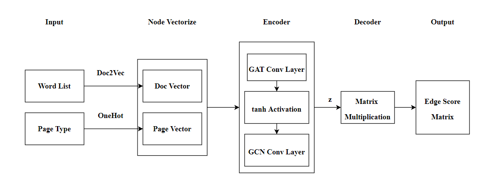

# Link & Recommendation, Rice Datathon 2022
---

By [Tianjian Sun](https://github.com/TianjianSun), [Yuhan Yang](https://github.com/yune-lilias), [Haijiao Lu](https://github.com/LHJ98) and [Yun Sun](https://github.com/SophieSUN88).

---

## Project Description

This repository is for the project of [Rice Datathon 2022](https://rice-datathon-2022.devpost.com/?ref_feature=challenge&ref_medium=discover), and this track is offered by [Bill.com](https://www.bill.com/). These days, graph is widely used to represent data with much inter-relation. But most of time it's impossible to get a graph showing all the edges which exist, thus it's necessary to build a model learn from a part of the graph while most edges are missing, and let the model predicts existence of potential edges. This technique is a nature choice in making recommendation systems.

---

## What it does
Given part of a undirected graph with node & edge information, on one hand the goal of our project is to make a prediction on whether an edge (link) exists between two nodes, as the edge information is not in our training set. On the other hand, the project can find k node most likely to have a connection with the given node, which is a good simulation of a rel-world a recommendation system.

---

## How we built it
1. As node features are various number of different "words" (index), to make it a structured input for our model, first we vectorize the "words". To make it clear, we map each the nodes into an 200-dimension vector. This is accomplished by a Doc2Vec model, which puts two nodes closer if their features are more similar (or related).
2. We use the negative sampling method to define weights for no-exist edges. Besides, we split our train data into three set: train set, validation set and test set, to keep track of how well our model performs.
3. Normal cnn/rnn works well if we just train on node features, but it fails to make use of edges information. For this reason we use graph neural network in (py)torch-geometry. Our neural network consists two parts: one "encoder" to embed nodes, and one "decoder" to calculate "scores" between each pair of nodes. In encoder, we use two different GNN networks: one graph attention network and one graph convolution network, connected by a *tanh* activation layer.
4. After reading testing node pairs, our project searches the corresponding scores from score matrix, and let positive score to be "likely to have a edge" while negative score means the opposite.
5. To make it easier to use, we also build a GUI with edge prediction and node recommendation (print k nodes with highest scores) based on user's input node ids and an integer k. Some necessary data is stored locally upon the first used.
6. We also try the HTML web site to make the interface with another style which we can make improvement in the future.

---

## Challenges we met
1. It's hard for us to build a gnn, which all of us have nearly no experience and knowledge about it.
2. Running time is too long since the model and score matrix is so large, making it slower to debug. Even with smaller dataset will it takes quite a long time for pytorch to set up in pycharm and vscode. 
3. After we choose to store some variable locally, the file size is also quite large and it's difficult to share with teammate as it exceeds github file size limitation.
4. It's hard to find a way to add regularization part to avoid overfitting.
5. Not enough time to read essays and compared with different gnn models in pytorch

---

## Accomplishments that we're proud of
1. Our project can get a high accuracy in validation and test(split from train) data, and we successfully finish the functionality finding k nodes have highest score with user input node number. 
2. We build a nice gui for our project.
3. After the first search in gui, following search takes much less time (in 10s).

---

## What's next for L&R
1. Try to deploy the project on cloud workspace, which will save the time setting up gui and load local variables
2. Make GUI more user-friendly
3. Train multiply model, use mean of all models prediction results to be our output rather than single prediction.

---

## Built With
- numpy & matplotlib: based vector calculation and plot function
- Qtdesigner: build GUI
- Prettier : build HTML
- gensim : build doc2vec model to vectorize nodes
- pandas : load csv to our program
- pytorch-geometry : gnn related functions
- other tools: jypyter, pycharm, VS Code

---
